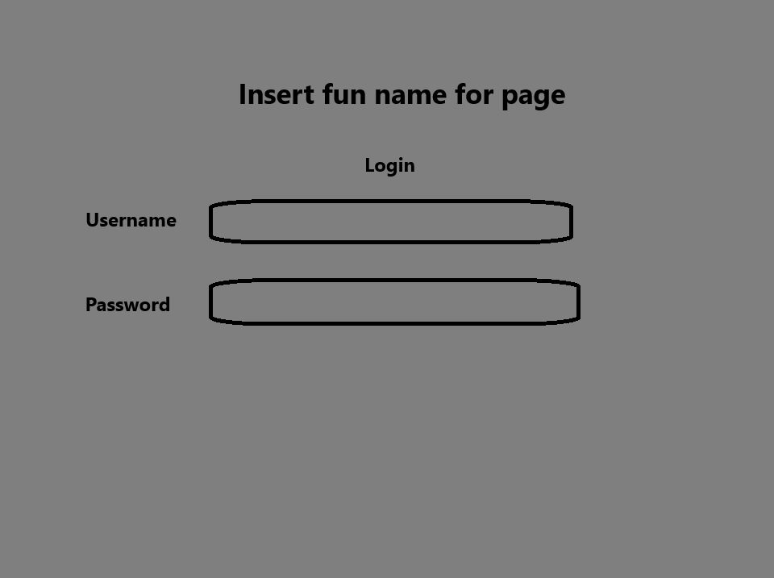
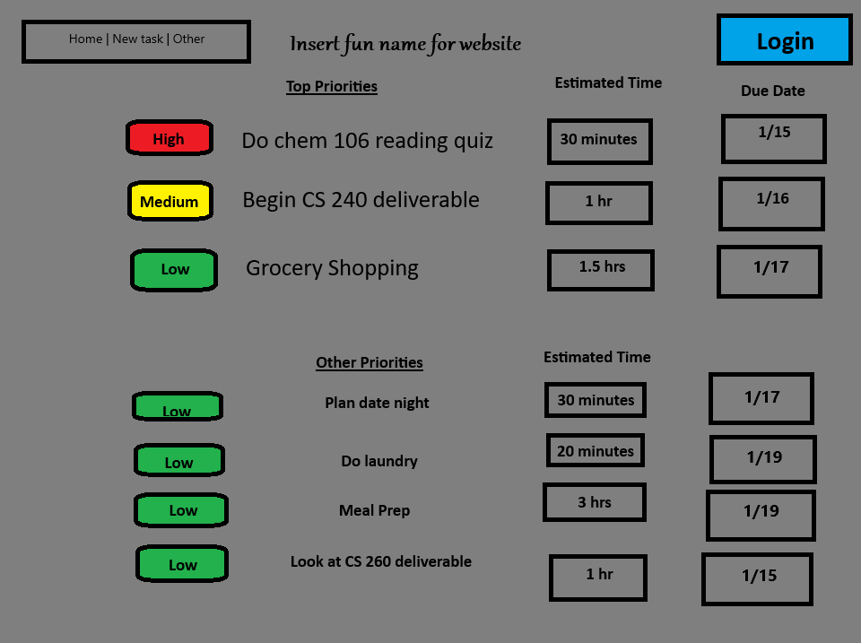
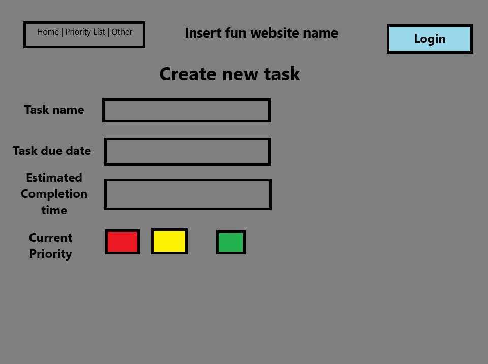

# Still working on a cool name

## 🚀 Specification Deliverable

### Elevator Pitch

I struggle with ADHD. This struggle makes it difficult for me to remember all of the tasks that I have going on and can make it difficult to priortize each task in an appropriate manner. This has caused me to forget about big projects, plans with friends, and many other meetings. An easy solution to this could be to write everything down and constantly check my list. However, this can end up causing me to have more anxiety as I keep seeing all of the things I need to get done. If only there was a way to be able to write everything down and priortize those tasks so that I don't forget to do anything, but don't feel the stress with seeing a long list of tasks. Well I'm hoping to solve this with this amazing planning and prioritizing tool, **insert cool name for website**. This tool will help someone to organize all of the many tasks that they have to do and will send reminders about upcoming due dates for tasks you may have forgotten about. Gone are the days of writing down a plan to get all of your tasks done to only to lose the plan or forget that you made this plan. With **insert cool name for website** you can kiss those stress filled days goodbye!

### Key Features
* Login athentication required for each user.
* Tasks will be saved in database.
* Tasks will update priority in real time as task dates get closer.
* Calendar will create scheduled times when tasks should get started during based on your calendar and estimated time of tasks.
* Notifications about current traffic condiditons and leaving for next event are shown as well.

### Technologies

**HTML:** 3-4 html pages
1. Homepage/Login
2. Priority task dashboard
3. Add new tasks page
4. Other page (Calendar, traffic, etc.)

**CSS:** Application styled in a way to support the user experience.

**JavaScript:** Provides functionality to buttons, drop downs, etc. using JavaScript and the React web framework.

**Services:** Website will use API's for calendar and traffic services among potential use for others depending on difficulty to include.

**Authentication:** Login page will allow users to provide authentication for their account and login. After login, user's account name will be displayed in the login button corner.

**WebSocket data:** Traffic data will be update to inform user if they need to leave earlier for an event. Or will give an alert if a task is due soon and hasn't been completed.

## 🚀 AWS deliverable

For this deliverable I did the following. I checked the box `[x]` and added a description for things I completed.

- [x] **Server deployed and accessible with custom domain name** - [My server link](https://jordanhiatt.org).

## 🚀 HTML deliverable

For this deliverable I did the following. I checked the box `[x]` and added a description for things I completed.

- [x] **HTML pages** - I created 8 html pages for my website 1 login, 1 signup, 1 home page, and then 5 tool pages.
- [x] **Proper HTML element usage** - I used HTML elements properly in all of my html pages.
- [x] **Links** - I have links connecting all of my pages together through the navigation page. I also have a link connecting to my github page on the bottom of each page.
- [x] **Text** - Text was added to my page describing what each tool could be used for.
- [x] **3rd party API placeholder** - I created a calendar out of a table to act as a placeholder for a 3rd party API to be added in later.
- [x] **Images** - 3 images were added to different HTML pages. 1 on the sign up page, 1 on the homepage, and another on the url holder.
- [x] **Login placeholder** - There is a login html page that will be used to store login credentials.
- [x] **DB data placeholder** - Multiple form submissions are included throughout the website. These forms are used to save tasks, hold calendar data, hold onto url's, ect. Specifically this is shown on the Productivity Calendar page.
- [x] **WebSocket placeholder** - I currently have a websocket placeholder in place for when someone enters a new task (Productivity Calendar page). When a new task is submitted all users will be notified of a task being added. Future deliverables may adjust this feature, but for now that is where this technology is planned on being used.

## 🚀 CSS deliverable

For this deliverable I did the following. I checked the box `[x]` and added a description for things I completed.

- [ ] **Header, footer, and main content body** - I did not complete this part of the deliverable.
- [ ] **Navigation elements** - I did not complete this part of the deliverable.
- [ ] **Responsive to window resizing** - I did not complete this part of the deliverable.
- [ ] **Application elements** - I did not complete this part of the deliverable.
- [ ] **Application text content** - I did not complete this part of the deliverable.
- [ ] **Application images** - I did not complete this part of the deliverable.

## 🚀 React part 1: Routing deliverable

For this deliverable I did the following. I checked the box `[x]` and added a description for things I completed.

- [ ] **Bundled using Vite** - I did not complete this part of the deliverable.
- [ ] **Components** - I did not complete this part of the deliverable.
- [ ] **Router** - Routing between login and voting components.

## 🚀 React part 2: Reactivity

For this deliverable I did the following. I checked the box `[x]` and added a description for things I completed.

- [ ] **All functionality implemented or mocked out** - I did not complete this part of the deliverable.
- [ ] **Hooks** - I did not complete this part of the deliverable.

## 🚀 Service deliverable

For this deliverable I did the following. I checked the box `[x]` and added a description for things I completed.

- [ ] **Node.js/Express HTTP service** - I did not complete this part of the deliverable.
- [ ] **Static middleware for frontend** - I did not complete this part of the deliverable.
- [ ] **Calls to third party endpoints** - I did not complete this part of the deliverable.
- [ ] **Backend service endpoints** - I did not complete this part of the deliverable.
- [ ] **Frontend calls service endpoints** - I did not complete this part of the deliverable.

## 🚀 DB/Login deliverable

For this deliverable I did the following. I checked the box `[x]` and added a description for things I completed.

- [ ] **User registration** - I did not complete this part of the deliverable.
- [ ] **User login and logout** - I did not complete this part of the deliverable.
- [ ] **Stores data in MongoDB** - I did not complete this part of the deliverable.
- [ ] **Stores credentials in MongoDB** - I did not complete this part of the deliverable.
- [ ] **Restricts functionality based on authentication** - I did not complete this part of the deliverable.

## 🚀 WebSocket deliverable

For this deliverable I did the following. I checked the box `[x]` and added a description for things I completed.

- [ ] **Backend listens for WebSocket connection** - I did not complete this part of the deliverable.
- [ ] **Frontend makes WebSocket connection** - I did not complete this part of the deliverable.
- [ ] **Data sent over WebSocket connection** - I did not complete this part of the deliverable.
- [ ] **WebSocket data displayed** - I did not complete this part of the deliverable.
- [ ] **Application is fully functional** - I did not complete this part of the deliverable.
